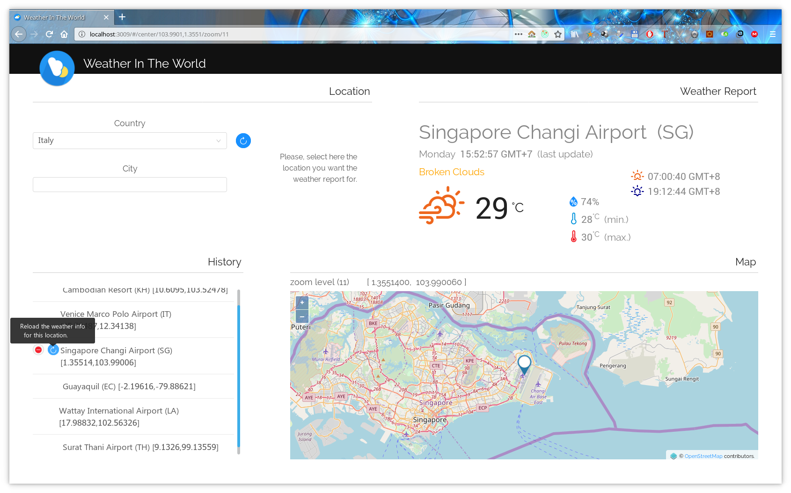

# boot2-react-J10

PoC project with Spring Boot 2 (Java 10) as backend and React/Redux (Typescript 2.9) as frontend.

## User Guide (as of today... more features and pages to come)

User selects the country and then enters names of locations in an auto-completion input field.

Suggestions are provided, after the input prefix, via backend querying an ElasticSearch instance.

When the location is selected ...

- related weather information are retrieved from [OpenWeatherMap](https://www.openweathermap.org) and shown in a "Weather" section
- the location is geographically shown in a "Map" section.
- the location is added to a selection History, from where it can be selected again. Weather information for every location are also cached to the History to save api calls to OWM.

**boot2-react-J10** is a PoC project to experiment with the most recent versions of the libraries and frameworks I am using professionally.
The idea is to constantly migrate/update the project as soon as a new release of a dependency is available, or even to replace a dependency if new/better solutions come out.

Development takes place through progressive feature branches, in order to make it easier to understand the differences with the previous branch, following the introduction of a new feature, or the migration to a new release of a dependency.

## Main Dependencies

### Backend

| Tech. | Rel. | To migrate to |
| --- | ---:| --- |
Java (JDK) | 10.0.1 |
ElasticSearch | 6.3.0 |
ElasticSearch Java Client | 5.6.9 | REST API 6.3
Spring Boot | 2.0.2.RELEASE |
Undertow | 1.4.25.Final |

### Frontend

| Tech. | Rel. | To migrate to |
| --- | ---:| --- |
Typescript | 2.9.1 |
Ant Design | 3.6.2 |
Openlayers | 4.6.5 |
React | 16.4.0 |
React-Redux | 5.0.7 |
Redux-Observable | 1.0.0-beta.2 |
Rxjs | 6.2.1 |
Styled-Components | 3.3.2 |

## [Backend](backend/README.md#backend)

### [Configuration](backend/README.md#bconfiguration)

### [Building the backend artifact](backend/README.md#building-the-backend-artifact)

### [Running the backend service](backend/README.md#running-the-backend-service)

### [REST Endpoints](backend/README.md#rest-endpoints)

## [Frontend](frontend/README.md#frontend)

### [Configuration](frontend/README.md#configuration)

### [Building the web app](frontend/README.md#building-the-frontend-app)

### [Running the web app](frontend/README.md#running-the-frontend-app-locally)
