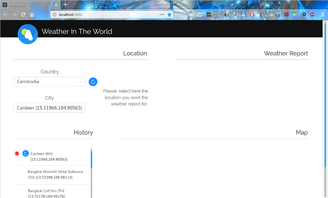

# boot2-react-J10

PoC project with Spring Boot 2 (Java 10) as backend and React/Redux (Typescript 2.9) as frontend.

User selects the country and then enters names of locations in an auto-completion input field.

Suggestions are provided, according the input prefix, via backend querying a remote ElasticSearch instance.

When the location is selected

- related weather information are retrieved from OpenWeatherMap and shown in a "Weather" section
- the location is geographically shown in a "Map" section.
- the location is added to a selection history, from where it can be selected again

## [Backend](backend/README.md#backend)

### [Backend configuration](backend/README.md#backend-configuration)

### [Building the backend artifact](backend/README.md#building-the-backend-artifact)

### [Running the backend service](backend/README.md#running-the-backend-service)

## [Frontend](frontend/README.md#frontend)

### [Frontend configuration](frontend/README.md#frontend-configuration)

### [Building the web app](frontend/README.md#building-the-web-app)

### [Running the web app](frontend/README.md#running-the-web-app)
